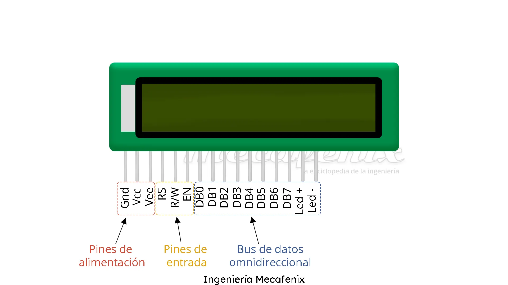
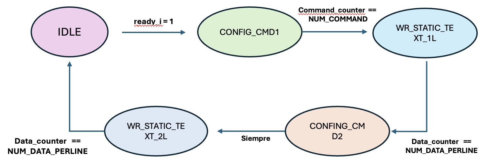
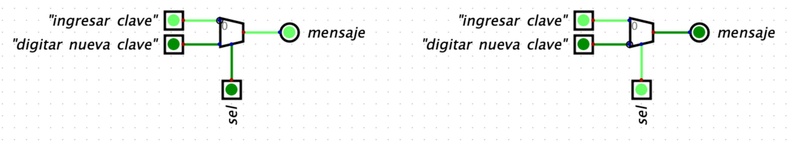

# Lab04 - Visualización usando pantalla LCD 16x2

# Integrantes

-Jonathan Alexander Ducuara Enciso - C.C. 1031648483

-Sofia Cabanzo Sanabia - C.C. 1053332421

-Valentina Parra Stella - vparras@unal.edu.co

18 de Junio del 2026

# Informe

Indice:

1. [Diseño implementado](#diseño-implementado)
2. [Simulaciones](#simulaciones)
3. [Implementación](#implementación)
4. [Conclusiones](#conclusiones)
5. [Referencias](#referencias)

## Diseño implementado
### Descripción

En este laboratorio se busca comprender el funcionamiento de una pantalla LCD (*Liquid Crystal Display* o pantalla de cristal líquido), así como los principios básicos de su comunicación y control. Con este propósito, se diseñará e implementará un código capaz de mostrar mensajes predeterminados en la pantalla mediante una visualización estática y, posteriormente, modificar dichos mensajes de acuerdo con las condiciones de operación del sistema mediante una visualización dinámica. De esta manera, se analizará tanto el proceso de envío de información a la LCD como la gestión de diferentes mensajes en tiempo real.

## Implementación

Una pantalla LCD es un dispositivo que permite visualizar información mediante cristales líquidos. En el casillero, su función es comunicar al usuario el estado del sistema, mostrando mensajes como el ingreso de clave, el cambio de contraseña o los dígitos digitados:

Para la implementación del sistema de visualización del casillero se utilizará una pantalla LCD de 16 columnas y 2 filas compatible con el controlador HD44780. Su función será proporcionar comunicación visual entre el sistema y el usuario, mostrando mensajes relacionados con el estado del casillero, como el ingreso de la clave, la verificación de acceso, el cambio de contraseña y la confirmación de operaciones.

La visualización será dinámica, de manera que el mensaje mostrado dependa del estado actual de la máquina de estados finitos (FSM). Para ello, la FSM genera una señal de control de 3 bits que será utilizada por el módulo de la LCD para seleccionar el mensaje correspondiente.

Los caracteres que visualizados en la pantalla se representarán mediante el código ASCII, permitiendo visualizar letras, números y símbolos requeridos por la aplicación. La comunicación entre la FPGA y la pantalla se realiza a través de las líneas de datos y las señales de control RS, R/W y E, encargadas de seleccionar el tipo de información enviada, definir la operación de lectura o escritura y sincronizar la transferencia de datos, respectivamente.

Para esto, se deben diseñar los mensajes estáticos y luego, convertirlos en dinámicos:

**-LCD estática:**  Se implementará una máquina de estados encargada de inicializar la pantalla LCD mediante la secuencia de comandos requerida por el controlador HD44780. Una vez completada la inicialización, esta misma lógica permitirá enviar los caracteres correspondientes al mensaje seleccionado por la FSM. Debido a que la LCD opera a una velocidad considerablemente menor que la FPGA, se utilizará un divisor de frecuencia para generar una señal de reloj más lenta y asi evitar errores por los tiempos de operación exigidos por el dispositivo.

**-LCD dinámica:** Para visualizar los mensajes estáticos dependiendo de una salida de 3 bits de la FMS se implementará un multiplexor (MUX) 1 a 2 (para 2 mensajes) encargado de mostrar la acción correspondiente, ya sea "ingresar clave" o "cambiar clave". Para esto la salida del FMS se convertirá en el selector del MUX y la entrada de este es un nivel lógico alto (1). La codificación se especifica más adelante

La visualización de mensajes en la pantalla LCD se implementó mediante módulos independientes, cada uno encargado de mostrar un texto específico al usuario. Para este proyecto se desarrollaron los módulos correspondientes a los mensajes *Ingresar clave* y *Digite nueva clave*, los cuales utilizan la misma estructura de funcionamiento y únicamente difieren en los caracteres almacenados en memoria.

Cada módulo emplea una memoria interna donde se almacenan los códigos ASCII de los caracteres que serán enviados a la pantalla. Con el fin de facilitar la modificación de los mensajes, estos códigos se guardan en archivos externos con extensión .txt, los cuales son cargados durante la inicialización mediante la instrucción:

      $readmemh("data_ingresar_clave.txt", static_data_mem);

o

      $readmemh("data_digitar_nueva_clave.txt", static_data_mem);

De esta manera, el contenido mostrado en la LCD puede modificarse sin necesidad de alterar la lógica principal del módulo.

Para el mensaje ``Ingresar clave'', el archivo de memoria contiene los códigos ASCII correspondientes a cada carácter del texto:

      49 6E 67 72 65 73 61 72
      20
      63 6C 61 76 65

donde, por ejemplo, el valor hexadecimal \texttt{49} representa la letra ``I'', mientras que 6E representa la letra ``n''. Los espacios se representan mediante el código hexadecimal \texttt{20}.

De forma análoga, para el mensaje ``Digite nueva clave'' se almacenan los códigos ASCII de cada uno de los caracteres que conforman la frase:

      
      44 69 67 69 74 65 20
      6E 75 65 76 61 20
      63 6C 61 76 65

Una vez cargados los datos, el controlador de la LCD recorre secuencialmente cada posición de memoria y envía los caracteres correspondientes a la pantalla. Para ello se utiliza un contador que determina la posición actual dentro del mensaje y una máquina de estados encargada de realizar la configuración inicial de la LCD y posteriormente la escritura de los caracteres.

La principal ventaja de esta metodología es que permite reutilizar la misma lógica de control para múltiples mensajes, cambiando únicamente el archivo de datos asociado. Esto simplifica el diseño, facilita el mantenimiento del código y permite ampliar el número de mensajes mostrados por el sistema sin modificar la estructura general del controlador de la pantalla.

## Conclusiones

- Se logró comprender el funcionamiento de una pantalla LCD 16x2 compatible con el controlador HD44780 y su integración con una FPGA.

- Se implementó un controlador para LCD estática capaz de inicializar el dispositivo y mostrar mensajes almacenados en memoria mediante códigos ASCII.

- Se desarrolló una solución de LCD dinámica que permite cambiar el mensaje mostrado según el estado del sistema utilizando una señal de control proveniente de una máquina de estados finitos (FSM).

- El uso de archivos externos `.txt` para almacenar los códigos ASCII simplificó la modificación y mantenimiento de los mensajes visualizados.

- Se verificó la importancia de respetar los tiempos de operación de la LCD mediante divisores de frecuencia y máquinas de estados dedicadas.

- La arquitectura implementada es modular y escalable, permitiendo agregar nuevos mensajes y funcionalidades sin modificar significativamente el diseño general.

- El sistema desarrollado proporciona una interfaz visual efectiva para el proyecto de casillero, mejorando la interacción entre el usuario y el sistema.

